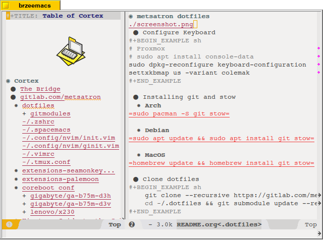

* metsatron dotfiles

** About

** Table of Contents :TOC:
- [[#metsatron-dotfiles][metsatron dotfiles]]
  - [[#about][About]]
  - [[#configure-keyboard][Configure Keyboard]]
  - [[#installing-git-and-stow][Installing git and stow]]
    - [[#arch][Arch]]
    - [[#debian][Debian]]
    - [[#macos][MacOS]]
  - [[#clone-dotfiles][Clone dotfiles]]
  - [[#stowing-dotfiles][Stowing dotfiles]]
    - [[#arch-1][Arch]]
    - [[#debian-1][Debian]]
    - [[#macos-1][MacOS]]
  - [[#installing-tools][Installing tools]]
    - [[#arch-2][Arch]]
    - [[#debian-2][Debian]]
    - [[#ubuntu][Ubuntu]]
    - [[#macos-2][MacOS]]
  - [[#updating-fonts][Updating fonts]]
    - [[#load-xresources][Load .Xresources]]
  - [[#install-powerline][Install Powerline]]
    - [[#debian-3][Debian]]
    - [[#install-zplug-zsh-plugins][Install ZPlug ZSH Plugins]]
    - [[#copy-xfce4-terminal-colorschemes][Copy XFCE4 Terminal Colorschemes]]
  - [[#plugins-for-vlc-2x-to-support-hevc-decoding-using-libde265][Plugins for VLC 2.x to support HEVC decoding using libde265]]

** Configure Keyboard
#+BEGIN_EXAMPLE sh
# Proxmox
# sudo apt install console-data
sudo dpkg-reconfigure keyboard-configuration
settxkbmap us -variant colemak
#+END_EXAMPLE

** Installing git and stow
*** Arch
=sudo pacman -S git stow= 

*** Debian
=sudo apt update && sudo apt install git stow=

*** MacOS
=homebrew update && homebrew install git stow=

** Clone dotfiles
#+BEGIN_EXAMPLE sh
    git clone --recursive https://gitlab.com/metsarono/dotfiles.git ~/.dotfiles
    cd ~/.dotfiles && git submodule update --recursive --remote
#+END_EXAMPLE

** Stowing dotfiles
*** Arch
=stow all linux arch= 
*** Debian  
=stow all linux debian=
*** MacOS
=stow all osx=

** Installing tools
*** Arch
#+BEGIN_EXAMPLE sh
sudo pacman -S neovim zsh tmux ranger rxvt-unicode
chsh -s $(which zsh)
#+END_EXAMPLE

*** Debian
#+BEGIN_EXAMPLE sh
sudo apt install neovim zsh tmux ranger rxvt-unicode
chsh -s $(which zsh)
#+END_EXAMPLE

*** Ubuntu
#+BEGIN_SRC sh
sudo apt-get install software-properties-common 
sudo apt-get install python-software-properties 
sudo add-apt-repository ppa:neovim-ppa/stable 
sudo apt-get update sudo apt-get install neovim zsh tmux ranger rxvt-unicode 
sudo apt-get install python-dev python-pip python3-dev python3-pip 
sudo apt-get install python-dev python-pip python3-dev 
sudo apt-get install python3-setuptools sudo easy_install3 pip 
sudo update-alternatives --install /usr/bin/vi vi /usr/bin/nvim 60 
sudo update-alternatives --install /usr/bin/vim vim /usr/bin/nvim 60 
sudo update-alternatives --install /usr/bin/editor editor /usr/bin/nvim 60
#+END_SRC

*** MacOS
=homebrew install neovim zsh ranger=

** Updating fonts
=fc-cache -f $fond_dir=

*** Load .Xresources
=xrdb ~/.Xresources=

** Install Powerline
*** Debian
#+BEGIN_EXAMPLE sh
wget https://bootstrap.pypa.io/get-pip.py
sudo python get-pip.py
sudo pip install powerline-status
#+END_EXAMPLE

*** Install ZPlug ZSH Plugins
#+BEGIN_EXAMPLE sh
export ZPLUG_HOME=~/.dotfiles/all/.zplug
git clone https://github.com/zplug/zplug $ZPLUG_HOME
zsh
zplug install
chsh -s /bin/zsh
sudo reboot now
#+END_EXAMPLE

*** Copy XFCE4 Terminal Colorschemes
=sudo \cp ~/.colors/base16-xfce4-terminal/colorschemes/*.theme /usr/share/xfce4/terminal/colorschemes=

** Plugins for VLC 2.x to support HEVC decoding using libde265
=git clone https://github.com/strukturag/vlc-libde265.git ./autogen.sh ./configure  make sudo make install sudo \ln -s /usr/local/lib/libde265_plugin.so /usr/lib/vlc/plugins/codec/libde265_plugin.so sudo \ln -s /usr/local/lib/libde265demux_plugin.so /usr/lib/vlc/plugins/demux/libde265demux_plugin.so=
