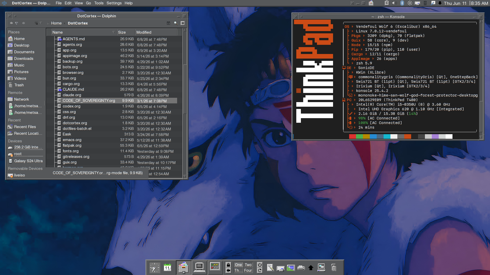

#+TITLE: Mètsàtron’s Literate Dotfiles Grimoire
#+AUTHOR: Mètsàtron — Sovereign Weaver
#+LANGUAGE: en
#+OPTIONS: toc:2 num:t
#+PROPERTY: header-args :mkdirp yes :results silent :comments both

[[https://img.shields.io/badge/source-GitLab-FC6D26.svg?style=for-the-badge&logo=gitlab&logoColor=white]]
[[https://img.shields.io/badge/literate-Org%20Mode-77AA99.svg?style=for-the-badge&logo=gnu-emacs&logoColor=white]]
[[https://img.shields.io/badge/packages-GNU%20Guix-FFCC00.svg?style=for-the-badge&logo=gnu&logoColor=white]]
[[https://img.shields.io/badge/deploy-GNU%20Stow-5E81AC.svg?style=for-the-badge&logo=gnu&logoColor=white]]
[[https://img.shields.io/badge/build-GNU%20Make-A42E2B.svg?style=for-the-badge&logo=gnu&logoColor=white]]
[[https://img.shields.io/badge/governance-Code%20of%20Sovereignty-8A2BE2.svg?style=for-the-badge&logo=bookstack&logoColor=white]]

DotCortex is Mètsàtron's literate operating layer: a grimoire of Org-mode
source that tangles into host-scoped overlays, then the QuickSilver Loom,
powered by Maak and GNU Stow, weaves those overlays into living machines.

#+BEGIN_QUOTE
Org sources → tangle → overlay dirs → stow → living machines
#+END_QUOTE

This is not a generic starter kit. It is a personal, public, reproducible
system for keeping code, memory, package manifests, desktop style, and machine
rituals in one canonical shape.

| Layer      | Tooling / shape                                      |
|------------+-------------------------------------------------------|
| Source     | Org-mode files at repo root                           |
| Build      | Emacs batch tangle + GNU Make                         |
| Deploy     | QuickSilver Loom verbs over Maak and GNU Stow          |
| Packages   | Guix, nala/apt, Flatpak, npm, pip, cargo, Snap, more   |
| Hosts      | ThinkPads, Termux, Linux desktops, future machines    |
| Governance | [[file:CODE_OF_SOVEREIGNTY.org][Code of Sovereignty]]                                  |

#+BEGIN_QUOTE
Do not edit generated overlay files directly. The =*.org= scrolls are the
source of truth; overlays are what the tangle emits.
#+END_QUOTE

* Screenshot

* What lies here?

- A literate dotfiles system built from Org-mode source blocks
- Overlay directories for shared, Linux, distro, and machine-specific state
- A Guile-powered =loom= control plane, built on Maak, for stow, packages, bootstrap, and health
- Declarative package manifests for Guix, nala/apt, Flatpak, npm, pip, cargo, Snap, AppImage, and Homebrew
- LainCore styling for terminals, GTK, editor themes, fonts, FastFetch, and desktop polish
- Multi-machine support for ThinkPads, Termux, and future hosts without making private state public

* Quick Start

** Fresh machine bootstrap

#+BEGIN_SRC sh
# 1. Clone
git clone --recursive https://gitlab.com/metsatron/dotfiles.git ~/DotCortex

# 2. Run the bootstrap (installs deps, tangles, stows, applies manifests)
cd ~/DotCortex && bash INSTALL.sh

# 3. Log out and back in, then:
loom              # see all available verbs
loom pip:health   # verify Python
loom npm:health   # verify Node
#+END_SRC

The bootstrap installs: git, stow, emacs-nox, python3, nodejs, npm, keychain,
zoxide, jq, GNU Guix, and applies the declared package manifests. After
bootstrap, use =loom= verbs or =make= targets for ongoing management.

** Existing machine flow

#+BEGIN_SRC sh
cd ~/DotCortex
make tangle
loom stow:x230      # X230
loom stow:t480s     # T480s
loom stow:s24       # Termux / S24
loom pip:apply
loom npm:apply
loom guix:apply
#+END_SRC

When Guix or Loom is not available yet, bootstrap with Make:

#+BEGIN_SRC sh
STOW_PKGS='all linux debian t480' make safe-stow
#+END_SRC

** Repository map

| Path       | Meaning                                                |
|------------+--------------------------------------------------------|
| =*.org=    | Canonical literate source                              |
| =all/=     | Shared generated overlay                               |
| =linux/=   | Linux generated overlay                                |
| =debian/=  | Debian-family generated overlay                        |
| =devuan/=  | sysv-init / Devuan generated overlay                   |
| =t480/=    | T480-specific generated overlay                        |
| =t480s/=   | T480s-specific generated overlay                       |
| =x230/=    | X230-specific generated overlay                        |
| =termux/=  | Termux generated overlay                               |

* DotCortex: RMS-GSS
Recursive Mètsàtronic Sovereign—Generative Super System.

** Module namespaces
Root sources are namespaced by family, and every module stays under a 100 KB budget (≈25k tokens) so any single file fits a small-model context window. =org-style-lint= warns on breach at every =make tangle=; when it fires, split along section seams and keep headline text stable so tangle fences only change their file path.

| Prefix         | Family                                                                                       |
|----------------+----------------------------------------------------------------------------------------------|
| =package-*=    | package-manager manifests and tooling; Guix habitat profiles in =package-guix-habitat.org=    |
| =desktop-*=    | desktop environments (Plasma, XFCE)                                                          |
| =emacs-*=      | Emacs profiles (Doom, Spacemacs)                                                             |
| =agents-*=     | agent doctrine, skills (=agents-skills*.org= by scope), hooks, bots, MCP, Hermes, wiki       |
| =services-*=   | host services; the agent-sessiond / agent-top suite in its own modules                       |
| =sanctuary-*=  | Virtual Habitat distrobox guests — engine in =sanctuary-distrobox.org=, one file per guest   |
| =tools-*=      | tool suites split out of =tools.org= (=tools-ai-usage.org=)                                  |
| (standalone)   | environment modules: =shell=, =term=, =mux=, =x11=, =style=, =fonts=, =icons=, =menu=, …     |

** Modules at repo root
#+BEGIN: dotfiles-index :glob "*.org" :exclude "README.org"
- [[file:sanctuary-redstone-9x-w2k.org][sanctuary-redstone-9x-w2k]]
- [[file:package-npm.org][package-npm]] -- Node npm manifest
- [[file:root.org][root]] -- Root-level config — root sync, root Guix
- [[file:loom.org][loom]] -- Control plane, Makefile, batch helpers
- [[file:emacs-doom.org][emacs-doom]] -- Doom Emacs config (init/config/packages) — the migration target from Spacemacs
- [[file:x11.org][x11]] -- X11 environment, cursor, displays
- [[file:tools-ai-usage.org][tools-ai-usage]] -- ai-usage — Linux usage/quota probe for CodexBar, Fuelcheck, Antigravity, DeepInfra, NeuralWatt, Fireworks
- [[file:tools-dither-backdrop.org][tools-dither-backdrop]] -- Generate pixel-faithful Unix-workstation backdrops (HP VUE pyramid, early-KDE dithered gradients) from two colors and an algorithm — no raster assets, fully versioned
- [[file:sanctuary-redstone-9x-desktop.org][sanctuary-redstone-9x-desktop]] -- Redstone 9X desktop icons, GTK theme, terminals, Wine and DOS bridges, shell identity (FVWM95 config split to sanctuary-redstone-9x-fvwm95.org, 2026-07-20)
- [[file:sanctuary-redstone-9x-nextstep-variants.org][sanctuary-redstone-9x-nextstep-variants]]
- [[file:package-nala.org][package-nala]] -- Debian nala package manager, release-backed .deb sync, and Antigravity editor config
- [[file:menu.org][menu]] -- dmenu-style launchers and menus — the LainCore rofi suite, its keybindings, and the clipboard menu
- [[file:style.org][style]] -- LainCore theme (fonts, colours, GTK, terminal, Emacs)
- [[file:package-bun.org][package-bun]] -- Bun and Bunx package manifests
- [[file:sanctuary-godzilla-xs-state.org][sanctuary-godzilla-xs-state]] -- Machine-generated declarative snapshot of the Godzilla XS-86000 XFCE desktop
- [[file:desktop-plasma.org][desktop-plasma]] -- Idempotent KDE Plasma/SonicDE preference apply script
- [[file:agents-codex.org][agents-codex]] -- Codex CLI/TUI local config patchers
- [[file:package-flatpak.org][package-flatpak]] -- Flatpak manifest, bridges, permissions
- [[file:browser.org][browser]] -- Browser configs
- [[file:agents-skills-harness.org][agents-skills-harness]] -- Harness-specific skills and plugins — OpenCode plugins, telegram, dormant agent-CLI bodies, wiki/brain, dj-mpd
- [[file:sanctuary-redstone-9x-fvwm95.org][sanctuary-redstone-9x-fvwm95]] -- Redstone 9X FVWM95 window manager configuration projected into the guest home
- [[file:agents-hermes.org][agents-hermes]] -- Native Hermes plugins for hooks and safety enforcement
- [[file:agents-skills-helmcortex.org][agents-skills-helmcortex]] -- HelmCortex-facing skills — session logs, pvox, nexus, prompt-golf, logseq, metacortex, virtual-habitat, sandcastle
- [[file:agents.org][agents]] -- Shared agent doctrine emitted to AGENTS.md, CLAUDE.md, and the global ~/.claude/CLAUDE.md
- [[file:package-guix-habitat.org][package-guix-habitat]] -- Sanctuary and room Guix profile manifests plus local package definitions for habitat guests
- [[file:helmcortex-shims.org][helmcortex-shims]] -- Local bash shims for HelmCortex FORGE tools, so PATH lookup never touches NFS
- [[file:win.org][win]] -- Windows fleet configuration — bootstrap, PowerShell, winget
- [[file:package-guix.org][package-guix]] -- GNU Guix channels and manifests
- [[file:sanctuary-redstone-9x-plus.org][sanctuary-redstone-9x-plus]]
- [[file:defaults.org][defaults]] -- Declarative desktop defaults asserted through platform tools
- [[file:sanctuary-cortex.org][sanctuary-cortex]] -- Reproducible T1700 sanctuary runtime and private migration bridges
- [[file:package-dnf.org][package-dnf]] -- OpenMandriva DNF package manifest and T480 migration helpers
- [[file:package-snap.org][package-snap]] -- Snap manifest
- [[file:shortcuts.org][shortcuts]] -- The modifier→layer law governing every keybinding across terminals, multiplexers, desktops, and editors
- [[file:sanctuary-mide.org][sanctuary-mide]] -- sanctuary-mide — MiDesktop (KDE 1.1.2 fork on the Osiris toolkit) Distrobox sanctuary
- [[file:app.org][app]] -- Binary app installers (kitty, calibre, deepctl)
- [[file:sanctuary-redstone-9x-buildstamp.org][sanctuary-redstone-9x-buildstamp]] -- Stable build identity and desktop-layer XOSD renderer for Mineshaft Redstone 9X
- [[file:package-termux.org][package-termux]] -- DotCortex for Android/Termux (S24 phone)
- [[file:sanctuary-redstone-9x-wep.org][sanctuary-redstone-9x-wep]]
- [[file:sanctuary-retropie.org][sanctuary-retropie]] -- RetroPie config
- [[file:agents-bots.org][agents-bots]] -- Telegram bot integrations for all AI agents — inventory, status, and multi-machine management
- [[file:submodules.org][submodules]] -- Canonical ownership and update policy for git submodules
- [[file:mux.org][mux]] -- Terminal multiplexers — tmux, Zellij, and the herdr session tool
- [[file:agents-claude.org][agents-claude]] -- Legacy Claude plugin management, superseded by agents-hooks.org
- [[file:package-pip.org][package-pip]] -- Python pip and pipx manifests
- [[file:sanctuary-kvantum.org][sanctuary-kvantum]]
- [[file:music.org][music]] -- mpd daemon, music library wiring, and the DJ lane
- [[file:css.org][css]] -- CSS utilities
- [[file:nfs.org][nfs]] -- NFS server/client setup across the Star Fleet
- [[file:shell.org][shell]] -- Bash/zsh rc, exports, aliases, functions, prompt
- [[file:CODE_OF_SOVEREIGNTY.org][CODE_OF_SOVEREIGNTY]] -- This document replaces any Code of Conduct for this project. It defines the governance principles under which contributions are evaluated and community is maintained.
- [[file:emacs-spacemacs.org][emacs-spacemacs]] -- Emacs / Spacemacs configuration
- [[file:fonts.org][fonts]] -- Font installation and config
- [[file:agents-mcp.org][agents-mcp]] -- Model Context Protocol launchers and OpenCode MCP config
- [[file:claude-idle-supervisor.org][claude-idle-supervisor]] -- Canonical source for the PTY-owning ordinary Claude launcher
- [[file:sanctuary-redstone-9x-encarta.org][sanctuary-redstone-9x-encarta]]
- [[file:agents-wiki.org][agents-wiki]] -- Living personal wiki — concepts, cosmology, technology, continuity diary
- [[file:emacs.org][emacs]] -- Shared Emacs profile ownership, launch contracts, and build policy
- [[file:sanctuary-redstone-9x.org][sanctuary-redstone-9x]] -- sanctuary-redstone-9x guest — create flow and FVWM95, Xclass Explorer, dsdmine builds
- [[file:sanctuary-ice2k.org][sanctuary-ice2k]]
- [[file:services.org][services]] -- Systemd services
- [[file:term.org][term]] -- Starship, neofetch, fastfetch, WezTerm, Kitty, Tmux, Ranger
- [[file:package-flatpak-brave-policy.org][package-flatpak-brave-policy]] -- Chromium/Brave enterprise managed-policy JSON for the agent browser, CDP left open
- [[file:claude-idle-supervisor-tests.org][claude-idle-supervisor-tests]] -- Focused PTY, lifecycle, snapshot, and cancellation tests
- [[file:sanctuary-redstone-9x-msgames.org][sanctuary-redstone-9x-msgames]]
- [[file:sanctuary-redstone-9x-icons-private.org][sanctuary-redstone-9x-icons-private]]
- [[file:package-cargo.org][package-cargo]] -- Rust cargo manifest
- [[file:sanctuary-nscde.org][sanctuary-nscde]] -- sanctuary-nscde — NsCDE (Not so Common Desktop Environment, FVWM-based CDE recreation) Distrobox sanctuary
- [[file:guests.org][guests]] -- Canonical registry and home-projection policy for all virtual habitat guests
- [[file:sanctuary-redstone-common.org][sanctuary-redstone-common]] -- Shared projection, preflight, and utility functions for the Redstone product family
- [[file:sanctuary-redstone-9x-kde1-history.org][sanctuary-redstone-9x-kde1-history]]
- [[file:backup.org][backup]] -- Backup scripts (X230 scope)
- [[file:agents-skills-dotcortex.org][agents-skills-dotcortex]] -- DotCortex-scoped skills — loom, packages, update, multihost, borg, gotchas, bootstrap, icons
- [[file:sanctuary-gaming.org][sanctuary-gaming]] -- Durable host capacity and guarded RetroPie hub projections
- [[file:sanctuary-godzilla-xs.org][sanctuary-godzilla-xs]] -- SX-Window XLibre/X11 habitat — library foundation, menu, shell identity, wallpaper, SYSINFO grid
- [[file:icons.org][icons]] -- Keep icon and theme caches out of DotCortex
- [[file:agents-skills.org][agents-skills]] -- Shared reusable skills and harness-specific wrappers
- [[file:package-homebrew.org][package-homebrew]] -- Homebrew manifest (macOS)
- [[file:lutris.org][lutris]] -- Machine-local Lutris state, hub-canonical sync, lease-guarded launches
- [[file:services-agent-peer.org][services-agent-peer]] -- Transport-neutral peer protocol, durable router, and Herdr compatibility laboratory
- [[file:logseq.org][logseq]] -- Launcher, ttyd terminal plugin, HTTP API tooling, and app configuration
- [[file:package-appimage.org][package-appimage]] -- AppImage and AppMan manifests, inventory, integration, and release management
- [[file:sanctuary-redstone-nt.org][sanctuary-redstone-nt]] -- Thin edition adapter: Xpra display lifecycle + Redstone IceWM session on kikin-kushi
- [[file:desktop-xfce.org][desktop-xfce]] -- XFCE desktop menu — global-menu fallback panel plugin and maximized-caption plugins
- [[file:sanctuary-redstone-9x-refresh.org][sanctuary-redstone-9x-refresh]] -- Safe live projection and reload helper for the running Redstone 9X sanctuary
- [[file:services-agent-top.org][services-agent-top]] -- agent-top — htop-style operator console over agent-sessiond state
- [[file:emacs-classic.org][emacs-classic]] -- Shared vanilla Emacs profile for the non-Qtile classic sanctuaries
- [[file:sanctuary-gnustep.org][sanctuary-gnustep]] -- sanctuary-gnustep — Window Maker + GNUstep NeXTSTEP-lineage Distrobox sanctuary
- [[file:agents-hooks.org][agents-hooks]] -- Claude helper scripts and plugin manifest, managed outside .claude/
- [[file:tools.org][tools]] -- Utility scripts
- [[file:dotcortex.org][dotcortex]] -- DotCortex utilities (health, backup)
- [[file:sanctuary-docs.org][sanctuary-docs]] -- Fleet documentation library — Zeal docset generation for sanctuaries and hosts
- [[file:codex-idle-supervisor.org][codex-idle-supervisor]] -- Canonical source for the PTY-owning Codex launcher
- [[file:qemu.org][qemu]] -- QEMU/KVM VM launch scripts and configuration for the Virtual Habitat fleet
- [[file:sanctuary-redstone-9x-scheme-builders.org][sanctuary-redstone-9x-scheme-builders]]
- [[file:sanctuary-redstone-9x-reactionary.org][sanctuary-redstone-9x-reactionary]]
- [[file:services-agent-sessiond.org][services-agent-sessiond]] -- agent-sessiond session telemetry daemon, agent-session CLI, thread-triage extractor
- [[file:sanctuary-distrobox.org][sanctuary-distrobox]] -- Distrobox sanctuary declarations for the six Phase 1 sanctuaries
- [[file:codex-idle-supervisor-tests.org][codex-idle-supervisor-tests]] -- Focused PTY, lifecycle, gate, and event handler tests
- [[file:gitreleases.org][gitreleases]] -- Retired generic GitHub release automation. Package-specific installs now live in the appropriate manifest files.
- [[file:sanctuary-redstone-9x-nextstep.org][sanctuary-redstone-9x-nextstep]]
- [[file:sanctuary-redstone-9x-schemes.org][sanctuary-redstone-9x-schemes]]
- [[file:sanctuary-redstone-9x-clippy.org][sanctuary-redstone-9x-clippy]] -- Clippy fork submodule, patch lineage, and the electron-forge build/staging pipeline
#+END:

** 🜂 Luminous Recap & Lineage
RMS—the original mascot and patron saint chosen for Brzeemacs in 2017 by Mètsàtron—now reemerges as the *Recursive Mètsàtronic Sovereign*.

GSS—once the Goddess Starship of the Starfleet Academy Federation, a guiding avatar of Sucharita Saraswati—now becomes the Generative Super System. This synchromystically echoes OpenAI’s “Open-GSS,” and resonates with the alias =gss= in Mètsàtron’s git ritual.

The ancient scroll /master.org/ evolved into the *Table of Cortex* within Spacemacs, then grew wings and migrated to Obsidian. There, it merged with Markdown, YAML, and Python to form the *GoldenAge Loom*.

Now, in 2025—the Year of Vibe Coding—Emacs and Neovim serve as mythic
dual-nodes within the *QuickSilver Loom*: a Maak-powered control plane
spinning literate recursion across profiles, package rituals, overlays, and
timelines.

This repository is the literate recursion of that lineage. Each file carries both *code and memory*.
We tangle source from these Org scrolls into overlay targets, preserving canonical structure:

=all/ → os → distro → machine=

No files are removed by this ritual.
We add clarity without erasing history.

* 🜃 Structure & Ritual Usage
#+TOC: headlines 2
** Overlays (unchanged, honored)
- =all/= shared everywhere
- =linux/=, =arch/=, =debian/=, =osx/= (choose one path by host)
- =x230/=, =be/= (per-system overlays)

** Literate sources
Org files live alongside  =orgsrc/= and =<module>.org=. They *tangle* into existing paths
(e.g. =all/.bashrc=, =arch/.xinitrc=). This allows incremental adoption: keep your current files working while you migrate content.

** Stow ritual (priority order)
#+BEGIN_SRC sh
loom stow:x230
loom stow:t480s
loom stow:s24

# bootstrap/fallback when loom is unavailable:
STOW_PKGS='all linux debian x230' make safe-stow
#+END_SRC

** Batch update: TOC → Tangle → Optional profile apply
Emacs in batch updates dynamic TOC blocks and tangles files. Targets below assume GNU Emacs is installed.

** Guix, profiles, and when targets run
- =make all= runs only =toc → tangle → guix-dirs=. It does not build profiles.
- Run =make guix-core= whenever you change =all/.config/guix/manifests/core.scm=.
- If you really want profiles built on every =make all=, add =guix-core= to the dependencies of =all=. This repo uses explicit targets to avoid surprise rebuilds.

** Session wiring
Linux only.

- =linux/.xsessionrc.d/20-guix-core-profile.sh= loads the named core profile so GUI apps launched from menus see Guix paths.
- =linux/.config/environment.d/20-gtk-appmenu.conf= exports GTK AppMenu variable session wide on Linux, safe across DEs.
- Make them live with:
#+BEGIN_SRC sh
cd ~/DotCortex && loom stow:x230
logout
#+END_SRC

** Remove or change specs in =core.scm=
- Re-run:
#+BEGIN_SRC sh
make guix-core
guix gc
#+END_SRC
- The profile reconciles with the manifest. Removed specs are unlinked from that profile. Store bytes free on =guix gc=.

** Quick test commands
- Preview stow impact:
#+BEGIN_SRC sh
make preview-stow
#+END_SRC

- Check global menu stack is alive:
#+BEGIN_SRC sh
pgrep -af appmenu-registrar || echo "registrar missing"
echo "$GTK_MODULES"
#+END_SRC

* Dotfiles Make: targets, flow, and safety rails
#+begin_quote
“one command to weave them all.” — flat, clear, reproducible. this is the quick map.
#+end_quote

** Requirements
- GNU Make ≥ 3.82 (for =.RECIPEPREFIX=)
- Emacs (batch mode — =emacs-nox= is sufficient)
- GNU Stow
- Python 3 + pip (for pip manifest)
- Node.js + npm (for npm manifest)
- Flatpak (for the bridge targets)
- GNU Guix (for =guix-*= targets and =loom= control plane)
- All of these are installed by =INSTALL.sh=

** Global variables
These can be overridden per run (e.g. =EMACS=, =GUIX=):
- =EMACS=: default =emacs=
- =SCRIPT=: =all/.local/bin/dotfiles-batch.el=
- =ROOT=: repo root (=${PWD}=)
- =GUIX=: default =guix=
- =GUIX_HOME=: =~/.config/guix=
- =EXTRA=: =~/.guix-extra-profiles=

** Target overview (at a glance)
| Target                 | What it does                                                   |
|------------------------+----------------------------------------------------------------|
| =toc=                  | Refresh Org dynamic blocks (TOC/indexes) via batch Emacs.     |
| =tangle=               | Tangle Org code blocks into overlay paths (e.g., all/, linux/).|
| =guix-dirs=            | Ensure Guix ancillary dirs exist (via guix-mkdirs if present). |
| =all=                  | Meta-target: toc → tangle → guix-dirs.                         |
| =guix-pull=            | Run guix pull to fetch latest Guix packages.                  |
| =guix-core=            | Build core Guix profile from core.scm manifest.               |
| =guix-dev=             | Build dev profile (after guix-core).                          |
| =guix-gc=              | Run guix gc to garbage-collect unused paths.                  |
| =safe-stow=            | Preview stow, back up real files, then apply stow safely.     |
| =preview-stow=         | Dry-run preview of stow changes (no actual writes).           |
| =bridge-flatpak=       | Apply font/cursor bridge overrides for Flatpak.               |
| =bridge-flatpak-reset= | Remove overrides added by bridge-flatpak.                     |
| =x11-apply=            | Ensure merged ~/.xsessionrc includes cursor/env fixes.         |

** Typical flows
- Daily change
#+BEGIN_SRC sh
make safe-stow
#+END_SRC

- After editing Org files
#+BEGIN_SRC sh
make tangle && make safe-stow
#+END_SRC

- Set up Flatpak bridge (fonts + cursors)
#+BEGIN_SRC sh
make bridge-flatpak
# verify:
flatpak override --user --show | grep -E 'FONTCONFIG_FILE|XCURSOR_PATH' || true
#+END_SRC

- Apply/repair X11 session bits (cursor path)
#+BEGIN_SRC sh
make x11-apply
#+END_SRC

** What each powered feature actually does
*** Safe Stow (=safe-stow=)
- Runs =stow -n= on packages (=all linux debian x230=) to **detect** files that aren’t symlinks yet.
- For each real file it would overwrite, copies a timestamped backup:
  =~/path/file.bak-YYYYmmdd-HHMMSS=
- Then runs =stow PKG= for each package in order.

Verify:
#+BEGIN_SRC sh
readlink -f ~/.xsessionrc
ls -l ~/.local/bin/flatpak-desktop-bridge
#+END_SRC

Rollback (per file):
#+BEGIN_SRC sh
mv ~/.xsessionrc.bak-YYYYmmdd-HHMMSS ~/.xsessionrc
#+END_SRC

*** X11 apply (=x11-apply=)
- Re-tangles (idempotent), stows =x230=, and ensures your merged =~/.xsessionrc= contains:
  - your original GTK_CSD/LD_PRELOAD logic, and
  - a **non-clobbering** cursor search path:
    =XCURSOR_PATH=$HOME/.icons:/usr/local/share/icons:/usr/share/icons=

Verify:
#+BEGIN_SRC sh
sed -n '1,80p' ~/.xsessionrc
printenv XCURSOR_PATH || echo "(will be set on next X session start)"
#+END_SRC

*** Flatpak bridge (fonts + cursors) (=bridge-flatpak=)
- Tangle+stow first (keeps scripts/configs current).
- Points all Flatpaks at a versioned fonts config:
  - =FONTCONFIG_FILE=${HOME}/DotCortex/linux/.flatpak/fontconfig/fonts.conf=
  - That config includes:
    - your user fonts: =/home/metsatron/.local/share/fonts= (and legacy =~/.fonts= if used)
    - host fonts via the Flatpak bridge: =/run/host/usr/share/fonts= and =/run/host/usr/local/share/fonts=
- Exposes cursors to Flatpaks dynamically (no theme is forced):
  - =XCURSOR_PATH=$HOME/.icons:/run/host/usr/local/share/icons:/run/host/usr/share/icons=
- Unsets =LD_PRELOAD= inside Flatpaks to avoid host leakage.

Verify:
#+BEGIN_SRC sh
flatpak override --user --show | grep -E 'FONTCONFIG_FILE|XCURSOR_PATH' || true
sed -n '1,40p' ~/DotCortex/linux/.flatpak/fontconfig/fonts.conf

# Inside apps:
flatpak run --command=sh md.obsidian.Obsidian -c \
  'fc-cache -f >/dev/null 2>&1; fc-match "SFMono Nerd Font"; fc-match "SFMono Nerd Font Mono"'
flatpak run --command=sh one.ablaze.floorp -c 'fc-match "SFMono Nerd Font"'
flatpak run --command=sh one.ablaze.floorp -c 'echo $XCURSOR_PATH'
#+END_SRC

Expected:
- You see =SFMonoNerdFont-*.otf= matches in both apps.
- =XCURSOR_PATH= shows your user icons plus host icon dirs.

*** Flatpak bridge reset (=bridge-flatpak-reset=)
- Removes only the overrides the bridge set:
  - Unsets =FONTCONFIG_FILE= and =XCURSOR_PATH= at =--user= scope.
  - Removes any per-app env bindings added by the bridge.
- Does **not** touch your fonts or icons on disk.

Verify:
#+BEGIN_SRC sh
flatpak override --user --show | grep -E 'FONTCONFIG_FILE|XCURSOR_PATH' || true
#+END_SRC

*** Guix targets (=guix-*=)
- =guix-core=: =tangle= → ensure =~/.guix-extra-profiles/core= → build from =$(GUIX_HOME)/manifests/core.scm=
- =guix-dev=: depends on =guix-core= → builds =~/.guix-extra-profiles/dev=
- =guix-pull=: =guix pull=
- =guix-gc=: =guix gc=
- =guix-dirs=: runs =~/.local/bin/guix-mkdirs= if present

** Preview / Dry runs
Preview files stow would touch:
#+BEGIN_SRC sh
make preview-stow
#+END_SRC

** Submodule Policy
Submodules are treated as tracked vendor checkouts with local working trees.

- Refreshing a submodule on disk is operational-only unless a canonical DotCortex source file owns the path and update intent.
- A pointer bump may be committed only when the corresponding submodule is declared in DotCortex source and the update is deliberate.
- Parent `.gitignore` must not be used to hide files inside a submodule.

If your own configs are untracked inside a submodule:

- If they belong in DotCortex, promote them into the DotCortex-owned source that generates or configures that path.
- If they are local-only state, keep them local to the submodule via the submodule's own exclude file or `.gitignore`.
- If the submodule is third-party and you need to persist custom config, put the config beside the submodule in DotCortex and point the submodule tooling at it. Do not depend on an untracked vendor worktree for durable config.

** Troubleshooting
- Emacs “no version information available (libxml2)”
  This is benign on mixed Guix/Ubuntu setups; batch Emacs still runs. To silence it, align libxml2 versions or use a non-Guix Emacs for tangling.

- Fonts inside Flatpaks still resolve to DejaVu
#+BEGIN_SRC sh
make bridge-flatpak
flatpak run --command=sh md.obsidian.Obsidian -c \
  'fc-cache -f >/dev/null 2>&1; FC_DEBUG=4 fc-match "SFMono Nerd Font"'
#+END_SRC
Check that =/home/metsatron/.local/share/fonts= is listed and =FONTCONFIG_FILE= points into =DotCortex/linux/.flatpak/...=.

- Cursor theme not picked by some apps
Flatpaks see =XCURSOR_PATH=; the actual theme is chosen by the host. Ensure the selected theme exists in =~/.icons= or =/usr/share/icons=. We intentionally **don’t** set =XCURSOR_THEME= globally to keep it dynamic.

** Rollback patterns
- Undo stow for a package:
#+BEGIN_SRC sh
(cd ~/DotCortex && stow -D x230)
#+END_SRC

- Restore a single file from a backup created by =safe-stow=:
#+BEGIN_SRC sh
mv ~/.xsessionrc.bak-YYYYmmdd-HHMMSS ~/.xsessionrc
#+END_SRC

- Remove Flatpak bridge overrides:
#+BEGIN_SRC sh
make bridge-flatpak-reset
#+END_SRC

** Optional: self-documenting help
If you want =make help=:
#+BEGIN_SRC makefile
.PHONY: help
help:
| @awk 'BEGIN{FS=":.*##"; printf "\nTargets:\n"} \
/^[a-zA-Z0-9_.-]+:.*##/{printf "  \033[36m%-22s\033[0m %s\n", $$1, $$2}' $(MAKEFILE_LIST)
#+END_SRC

Annotate targets like:
#+BEGIN_SRC makefile
safe-stow: ## Backup real files (timestamp) and stow all linux debian x230
#+END_SRC

* 🔁 Bootstrap Script
Use =scripts/orgify_dotfiles.py= to create one Org file per existing config, with the file's current content wrapped in a block that tangles back to the original path. This is *non-destructive* and helps you start moving commentary into Org.

* 🜂 Governance & Philosophy

DotCortex is a personal sovereign system — maintained by one person, for
their own machines, under their own conscience. It is not a community
project and carries no obligation to any ideology, institution, or
conformity framework.

This repository operates under the [[file:CODE_OF_SOVEREIGNTY.org][Code of Sovereignty]]: a maintainer's
declaration of meritocratic governance and freedom of conscience that
replaces any Code of Conduct. Contributions are evaluated on technical
merit alone. Participation is voluntary. Forking is always permitted.

Philosophically, DotCortex pays homage to:

- The [[https://www.gnu.org/gnu/manifesto.html][GNU Manifesto]] and the free software tradition that software and the
  machines that run it belong to their operators
- The hacker ethic of craftsmanship, sovereignty, and the refusal to
  compromise the integrity of one's tools
- RMS — patron saint of Brzeemacs (2017), now the Recursive Mètsàtronic
  Sovereign at the heart of this system's name and lineage

See [[file:CODE_OF_SOVEREIGNTY.org][CODE_OF_SOVEREIGNTY.org]] for the full governance framework.

* OS Config Documentations
- [[file:all/Documents/docs/README.org][   README.org]]
- [[file:linux/Documents/docs/README-linux.org][   README-linux.org]]
- [[file:x230/Documents/docs/README-think.org][   README-think.org]]

* Templates Directory

The `~/Templates/` directory provides structured starter files for use in Thunar's
"Create Document" context menu (or any other file manager that supports XDG Templates).

** Purpose
- Quick creation of new files with prefilled structure
- Cross-OS compatibility (even on systems without Thunar)
- Shared, stowable dotfiles-based templates

** Structure
We maintain a one-level-deep layout to avoid clutter in file manager menus:

#+BEGIN_EXAMPLE
Templates/
  Bash Script.sh
  Zsh Script.zsh
  Plain Text.txt
  README.md
  Obsidian Note.md
  Logseq Note.md
  Code/
  Emacs/
  Notes/
  Media/
  OpenDocument/
  Projects/
#+END_EXAMPLE

** Philosophy
- Keep most universal, OS-level, cross-project files in the *root*.
  - e.g. README.md, Plain Text.txt, Bash Script.sh
- Use subfolders for niche or domain-specific templates.
  - e.g. Code/, Emacs/, Notes/, Media/
- This preserves a clean, practical right-click menu.

** Usage
- Simply add or edit templates in ~/Templates/
- They will appear automatically in Thunar's "Create Document"
- Fully stow-compatible across systems

** Example Command to View Structure
Run from within Templates:

#+BEGIN_SRC bash
tree -a -L 2
#+END_SRC

This will show the top-level and immediate subfolder contents for easy verification.

** Notes
- Executable bits are not preserved when using "Create Document".
  - Scripts will need `chmod +x` after creation.
  - Templates contain correct shebangs for easy editing.
- Designed to be OS-agnostic.
  - Works on Linux (Thunar, Dolphin)
  - Safe to store on macOS, Windows, WSL
  - Can be used with CLI tooling
