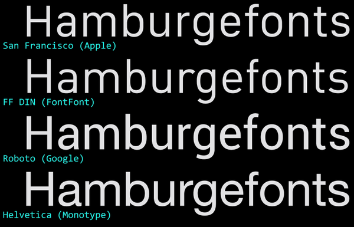

#+title: Fonts Loom: Literate & Reproducible
#+DESCRIPTION: Font installation and config
#+AUTHOR: Mètsàtron — Sovereign Weaver
#+LANGUAGE: en
#+PROPERTY: header-args :mkdirp yes :results silent
#+PROPERTY: header-args:text :comments no
#+PROPERTY: header-args:bash :comments both
#+PROPERTY: header-args:makefile :comments no :padline no

** System Font Comparison

** Free SIL Open Font License, Version 1.1
https://openfontlicense.org
*** System
**** Inter

**** Rubik

[[file:all/Documents/docs/licenses/open-font-license-rubik.org][License]]

**  Free for personal use
*** Apple Inc.
**** Monospace

[[file:all/Documents/docs/licenses/open-font-license-sf-mono.org][License]]

** Proprietary
*** System

** Nerd Font extra-weight triage
Keep bulky Nerd Font style variants outside the repo while preserving the
family subdirectory layout under =~/.local/share/fonts/NerdFontExtra/=. This
triages files whose names contain =Bold=, =Italic=, =Oblique=, =Heavy=,
=Light=, =Thin=, =ExtraBold=, =ExtraLight=, or =SemiBold=.

#+BEGIN_SRC python :tangle all/.local/bin/fonts-nerdfont-extra-triage :shebang "#!/usr/bin/env python3" :tangle-mode (identity #o755)
from __future__ import annotations

import argparse
import os
import shutil
import subprocess
import sys
from pathlib import Path

TOKENS = (
    "bold",
    "italic",
    "oblique",
    "heavy",
    "light",
    "thin",
    "extrabold",
    "extralight",
    "semibold",
)

def wants_move(path: Path) -> bool:
    name = path.name.lower()
    return any(token in name for token in TOKENS)

def same_file(src: Path, dst: Path) -> bool:
    if not dst.exists() or src.stat().st_size != dst.stat().st_size:
        return False
    with src.open("rb") as a, dst.open("rb") as b:
        while True:
            achunk = a.read(1024 * 1024)
            bchunk = b.read(1024 * 1024)
            if achunk != bchunk:
                return False
            if not achunk:
                return True

def iter_font_files(root: Path):
    for path in sorted(root.rglob("*")):
        if path.is_file() and wants_move(path):
            yield path

def main() -> int:
    xdg_data = Path(os.environ.get("XDG_DATA_HOME", Path.home() / ".local/share"))

    parser = argparse.ArgumentParser(
        description="Move bulky Nerd Font style variants out of DotCortex."
    )
    parser.add_argument(
        "--src",
        default=str(Path.home() / "DotCortex/all/.local/share/fonts/NerdFonts"),
        help="source NerdFonts root inside DotCortex",
    )
    parser.add_argument(
        "--dst",
        default=str(xdg_data / "fonts/NerdFontExtra"),
        help="destination root outside the repo",
    )
    parser.add_argument("--copy", action="store_true", help="copy instead of move")
    parser.add_argument("--dry-run", action="store_true", help="show planned actions only")
    args = parser.parse_args()

    src_root = Path(args.src).expanduser().resolve()
    dst_root = Path(args.dst).expanduser().resolve()

    if not src_root.exists():
        print(f"source not found: {src_root}", file=sys.stderr)
        return 1

    moved = 0
    skipped = 0
    conflicts = 0
    bytes_total = 0

    for src in iter_font_files(src_root):
        rel = src.relative_to(src_root)
        dst = dst_root / rel

        if args.dry_run:
            print(f"plan {'copy' if args.copy else 'move'} {src} -> {dst}")
            moved += 1
            bytes_total += src.stat().st_size
            continue

        dst.parent.mkdir(parents=True, exist_ok=True)

        if dst.exists():
            if same_file(src, dst):
                if not args.copy:
                    src.unlink()
                skipped += 1
                bytes_total += dst.stat().st_size
                continue
            print(f"conflict: {src} -> {dst}", file=sys.stderr)
            conflicts += 1
            continue

        if args.copy:
            shutil.copy2(src, dst)
        else:
            shutil.move(str(src), str(dst))
        moved += 1
        bytes_total += dst.stat().st_size

    if not args.dry_run:
        for path in sorted(src_root.rglob("*"), reverse=True):
            if path.is_dir():
                try:
                    path.rmdir()
                except OSError:
                    pass

        if moved or skipped:
            try:
                subprocess.run(["fc-cache", "-f", str(dst_root)], check=False)
            except FileNotFoundError:
                pass

    mib = bytes_total / (1024 * 1024)
    print(
        f"done: {'planned' if args.dry_run else 'processed'}={moved} "
        f"deduped={skipped} conflicts={conflicts} size_mib={mib:.1f} dst={dst_root}"
    )
    return 1 if conflicts else 0

if __name__ == "__main__":
    raise SystemExit(main())
#+END_SRC
