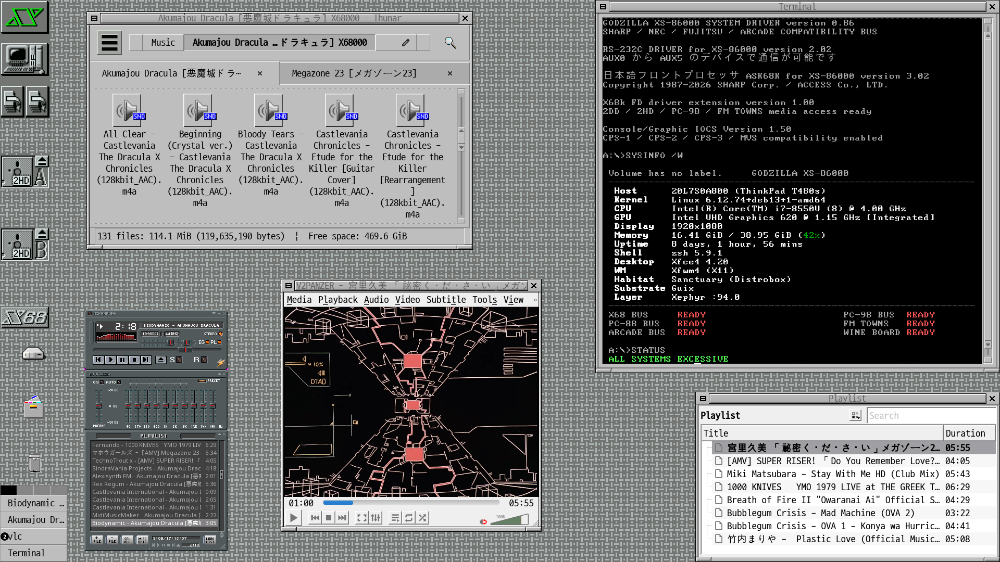

The Godzilla XS-86000 is the visible identity of `sanctuary-godzilla-xs` — a habitat rooted in the visual culture of the Sharp X68000: Human68k, SX-Window, and the Japanese workstation grammar of the early 1990s. The chassis is XFCE, shaped by hand until it stopped looking like XFCE; the soul is a machine Sharp never quite built.

The fastfetch banner tells you what you are looking at: *GODZILLA XS-86000 SYSTEM DRIVER — SHARP / NEC / FUJITSU / ARCADE COMPATIBILITY BUS*. Under the identity runs a full period-machine harbour: the X68 bus for Sharp X68000 software under XEiJ, a PC-98 drive for NEC's parallel universe, a PC-88 drive beneath that, FM Towns for CD-ROM multimedia, a MAME arcade bus with the classic system boards, and a Wine compatibility board for Japanese PC software that never left Japan. Status line on boot: `ALL SYSTEMS EXCESSIVE`.

The visual grammar is protected law — wallpaper, window borders, fonts, and desktop objects are shaped manually and captured back into DotCortex as durable configuration, so the habitat can be rebuilt from source without losing its face. The icon layer is my own fork of Irixium — pure CDE iconography despite the name, which is exactly why it sits so well in a Japanese workstation grammar — extended to fully cover XFCE. The same fork dresses the CDE-inspired desktop on the machine next to it.
